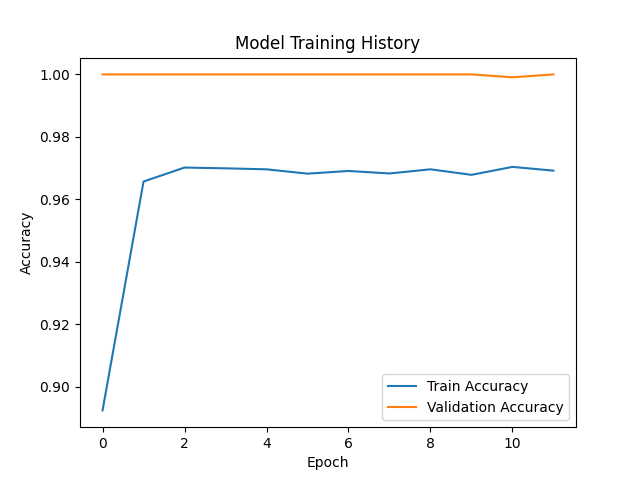

# Oral Cancer Prediction Model

## Project Overview
A neural network model for predicting oral cancer diagnosis based on clinical and behavioral factors. Implements feature preprocessing, model training with early stopping, and performance evaluation.

## Requirements
- Python 3.8+
- Install dependencies: `pip install -r requirements.txt`

## Dataset
- `oral_cancer_prediction_dataset.csv`: Clinical records with features including:
  - Demographic data (Age, Gender, Country)
  - Behavioral factors (Tobacco Use, Alcohol Consumption)
  - Clinical indicators (Tumor Size, HPV Infection, Oral Lesions)

## Usage
1. Train model:
```bash
python oral_cancer_model.py
```
2. Model outputs:
- Trained model: `oral_cancer_model.keras`
- Evaluation metrics: Precision, Recall, ROC AUC
- Training history plot: `training_history.png`

## Model Architecture
- Preprocessing pipeline with feature scaling and selection
- Neural network with:
  - Input layer (10 features)
  - Batch-normalized hidden layer (8 units, ReLU)
  - Dropout regularization (60%)
  - Sigmoid output layer

## Evaluation
- Test set performance saved in `test.csv`
- Confusion matrix and ROC curve generated during evaluation

